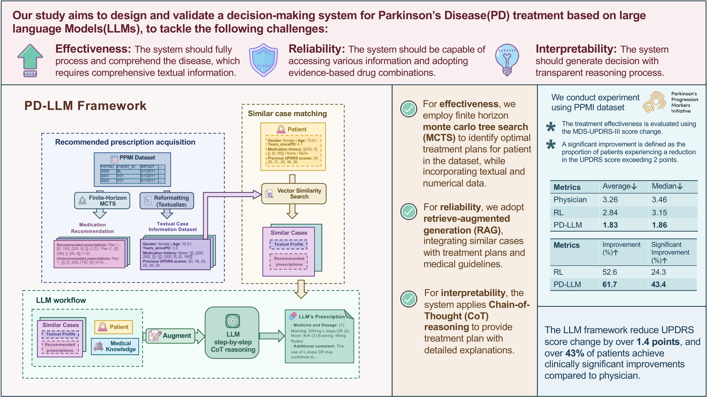

# Leveraging LLMs for Personalized PD Treatment

[](https://www.techrxiv.org/users/887442/articles/1265499-leveraging-large-language-models-for-personalized-parkinson-s-disease-treatment) [](https://github.com/360ZMEM/PD-LLM/blob/main/files/supplementary_material.pdf) [](https://github.com/360ZMEM/PD-LLM)

:information_source: **The supplementary material can be accessed from this link:** [](https://github.com/360ZMEM/PD-LLM/blob/main/files/supplementary_material.pdf). Also, we provide a download link from [**Google Drive**](https://drive.google.com/file/d/1UevGHiOANzUOe071atnVloJ_x7JEM1gR/).

This repository contains Python code implementation and Supplementary Materials for the paper "Leveraging Large Language Models for Personalized Parkinson’s Disease Treatment".



## Get Started

Run this command to install the dependencies:

```bash
pip install -r requirements.txt
```

This program does not require high-end GPU capabilities. For TensorFlow 2, installing the CPU version will suffice.

Before proceeding, please ensure:

- **Verify dependency versions.** The requirements.txt file lists the minimum requirements. If using the default embedding model configuration (this repository employs embedding models from [abhinand5/MedEmbed](https://github.com/abhinand5/MedEmbed)) or local model calls, ensure the following packages are installed with correct CPU/GPU versions:

  ```
  langchain_huggingface
  torch
  transformers
  faiss
  ```

- Properly configure either online or open-source embedding models.
- Provide valid LLM API keys or correctly configure local open-source model calls.
- Obtain access permissions to the [Parkinson Progression Markers Initiative (PPMI) database](https://www.ppmi-info.org/access-data-specimens/download-data) and place the dataset in the designated directory.

All configurable parameters can be modified in `config.py`. Additionally, different models may require specific LangChain invocation methods, so please verify the code in lines 363-397 of `llm_predict.py` according to your setup.

---

## MCTS

First, execute the following command to generate the synthetic PPMI dataset and train the UPDRS score prediction model:

```bash
python dataset_gen.py
```

Then run this command to generate the MCTS medication policy dataset:

```bash
python run_mcts_policy.py --parallel_num 5
```

The `parallel_num` parameter enables multi-processing to utilize multiple CPU cores. Adjust this value based on your hardware configuration. For example:
- **Recommended**: `2` for 16GB RAM systems, `5` for 32GB RAM systems.

---

## LLM Prescription Generation

Next, execute this command to generate LLM-based prescription texts and build the LLM dataset:

```bash
python LLM_predict.py --similar_case_num 2 --parallel_num 100
```

The `parallel_num` parameter controls concurrent LLM API calls. Ensure your LLM service provider (e.g., Deepseek) supports sufficient request quotas. For local model inference or limited quotas, reduce the concurrency level.

---

## Experimental Figure Generation

All experimental results will be saved in the `exp_results` directory. To analyze results, compute evaluation metrics, and generate figures, run:

```bash
python llm_analysis.py
```


## Acknowledgement

Data used in this article were obtained from the [Parkinson Progression Markers Initiative (PPMI) database](www.ppmi-info.org/access-data-specimens/download-data), which is sponsored by the Michael J. Fox Foundation for Parkinson’s Research (MJFF). Additionally, we would like to express our sincere gratitude to Baucum et al., whose research published in [Management Science](https://pubsonline.informs.org/doi/10.1287/mnsc.2023.4747) applied RL to PD treatment. They shared relevant code, which greatly benefited our research. 

## Citation

If you find it useful for your work please cite:

```bibtex
@article{Zhang_2025,
title={Leveraging Large Language Models for Personalized Parkinson's Disease Treatment},
url={http://dx.doi.org/10.36227/techrxiv.173929691.12336246/v1},
DOI={10.36227/techrxiv.173929691.12336246/v1},
publisher={Institute of Electrical and Electronics Engineers (IEEE)},
author={Zhang, Rongqian and Xie, Guanwen and Ying, Jie and Hua, Zhongsheng},
year={2025}}
```

